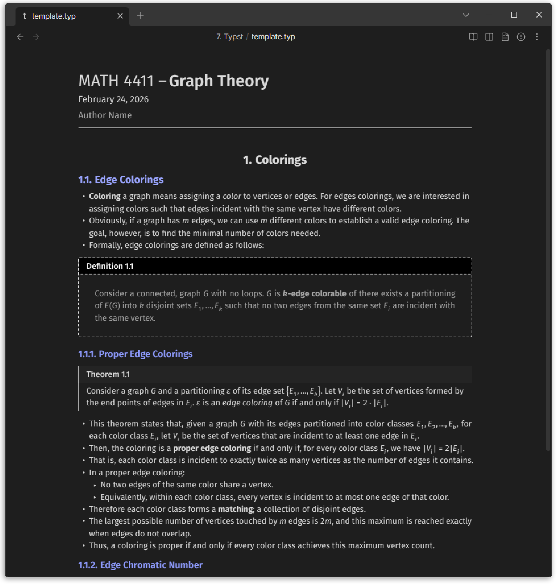

# Typst for Obsidian

Typst for Obsidian is a [Typst](https://typst.app) editor integrated directly into [Obsidian](https://obsidian.md), enabling you to create and preview Typst documents seamlessly within your notes. Create `.typ` files, edit with syntax highlighting, and render PDFs that adapt to your Obsidian theme.

<p align="center">
  
</p>

## Features

- Open `.typ` files in Obsidian
- VSCode-Like editor with Typst syntax highlighting
- Customizable syntax highlighting colors for dark and light themes
- Toggle between source and PDF preview modes
- PDF export to vault
- Theme integration - rendered PDFs adapt to Obsidian themes
- Template variables for dynamic theming (`%TEXTCOLOR%`, `%FONTSIZE%`, etc.)
- Package support - use local packages from data directory or auto-download from preview namespace
- System font support (desktop only)


## Usage

1. Create a new `.typ` file or open an existing one
2. Edit in source mode with syntax highlighting
3. Click the preview icon to render PDF
4. Click the export icon to save PDF to vault

More usage information, including commands and settings, can be found in the [docs](./docs/docs.md#usage).

### Template Variables

Template variables allow you to use Obsidian CSS styles in your Typst documents. You can use these variables directly in the editor, or in custom layout functions in settings to create dynamic themes that adapt to Obsidian's light/dark modes.

For example, to set the text color and page background color to match the Obsidian theme, you can use the following layout function:

```typst
#set text(fill: rgb("#%TEXTCOLOR%"), size: %FONTSIZE%)
#set page(fill: rgb("#%BGCOLOR%"), width: %LINEWIDTH%)
```

All template variables are listed in the [docs](./docs/docs.md#template-variables).

### Custom Layout Functions

Default page layouts functions can be configured in the settings:

- **Default Layout Functions** - Applied to all internal previews
- **PDF Export Layout Functions** - Applied only when exporting PDFs

More on layout functions and examples can be found in the [docs](./docs/docs.md#layout-functions).

### Custom Snippets

You can add custom Typst snippets as JSON for autocomplete in settings. Each snippet has a prefix (trigger) and body (lines to insert). Use `$1`, `$2`, etc., for tab stops.

Example (inserting a table aligned to the center):

```json
{
  "table": {
    "prefix": "tbl",
    "body": [
      "#align(center,",
      "\ttable(",
      "\t\tcolumns: $1,",
      "\t\t[$2],",
      "\t)",
      ")"
    ]
  }
}
```

## Settings

- **Default file mode** - Choose how `.typ` files open (source, preview, split)
- **Custom layout functions** - Set default page layout functions for previews and exports
- **Custom snippets** - Add custom Typst snippets for autocomplete
- **Font families** - Add custom font families for use in Typst documents
- **Auto-download packages** - Automatically download packages from the preview namespace when rendering
- **PDF settings** - Configure PDF export options (save location, open after export, etc.)
- **Syntax highlighting colors** - Customize syntax highlighting colors for light and dark themes
- **Editor settings** - Configure editor options (font size, line height, hotkeys, etc.)

A list of all settings and explanations can be found in the [docs](./docs/docs.md#settings).

## Commands

- **Create new Typst file** - Create a new `.typ` file in the current folder
- **Toggle preview** - Toggle between source and PDF preview modes
- **Export PDF** - Export the rendered PDF to your vault
- **Open PDF in split pane** - Open the rendered PDF in a split pane next to the source file
- **Insert snippet** - Insert a custom snippet at the cursor position

A list of all commands and explanations can be found in the [docs](./docs/docs.md#commands).

## Official Template

You can use the [official template](https://github.com/k0src/Typsidian) designed for Typst in Obsidian. It includes support for light/dark modes, titles, headers, and useful functions for displaying notes.

<p align="center">
  
</p>

To get started, import the template at the top of your Typst file:

```typst
#import "@preview/typsidian:0.0.2": *;

#show: typsidian.with(
  theme: "dark",
  title: "My Document",
  course: "CS4999",
  standalone: false
)
```

This template is an Obsidian-like theme for Typst, with support for light/dark modes, titles, headers, and some useful functions for displaying notes.

When using this template, I recommend setting the custom layout function in the settings to:

```typst
#set page(
  width: %LINEWIDTH%,
  height: auto,
  margin: (x: 0.25em, y: 0.25em),
  fill: rgb("%BGCOLOR%")
)
```

Make sure to set `standalone: false`. This will prevent the template from adding its own page layout. Additionally, make sure you have the required fonts installed and added to the font families in settings:

- [Fira Sans](https://fonts.google.com/specimen/Fira+Sans)
- [Fira Code](https://fonts.google.com/specimen/Fira+Code)
- [Fira Math](https://github.com/firamath/firamath/releases/)

## Installation

### Obsidian Community Plugins

_Coming soon..._

### Manual Installation

1. Download the latest release from the [Releases](https://github.com/k0src/Typst-for-Obsidian/releases) page
2. Extract `main.js`, `manifest.json`, `styles.css`, and `obsidian_typst_bg.wasm` to your Obsidian plugins folder (`.obsidian/plugins/typst-for-obsidian`)
3. Enable the plugin in Obsidian settings

## Contributing

Contributions are welcome, feel free to open issues or submit pull requests for bug fixes and new features. For development information, see the [docs](./docs/docs.md#development).

## Future Plans/Issues to Fix

- [ ] **Improve performance of PDF rendering**
- [x] Add "New Typst File" to context menu
- [x] Turn off live preview button when live preview is disabled
- [x] Open live preview in split pane hotkey
- [x] Open PDF in split pane button + hotkey
- [x] Editor zoom level
- [ ] Fix problems show up on wrong side of split pane
- [x] Fix pasting
- [ ] Fix scroll position restoration when toggling modes
- [ ] More default file modes - open in last mode, split live preview, split PDF
- [ ] Open in external editor
- [ ] Formatter for Typst code
- [ ] Editor font size setting
- [ ] Insert snippet command
- [ ] Tinymist LSP support
- [ ] Add support for jumping from preview/PDF to source by clicking on text
- [ ] Add backlink support in live preview
- [x] Support for more template variables
- [ ] Improve error handling and reporting
- [ ] Test and ensure support for all popular Typst packages
- [ ] Add support for rendering Typst code in fenced code blocks
- [ ] Better incremental complication
- [ ] Editor spellchecker
- [ ] Organize code...

## Acknowledgements

Compiler implementation inspired by [fenjalien/obsidian-typst](https://github.com/fenjalien/obsidian-typst).

[Tinymist TextMate grammar](https://github.com/Myriad-Dreamin/tinymist/tree/main/syntaxes/textmate)

## License

MIT
